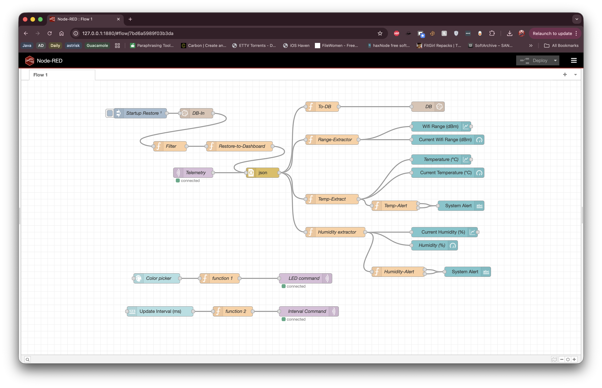
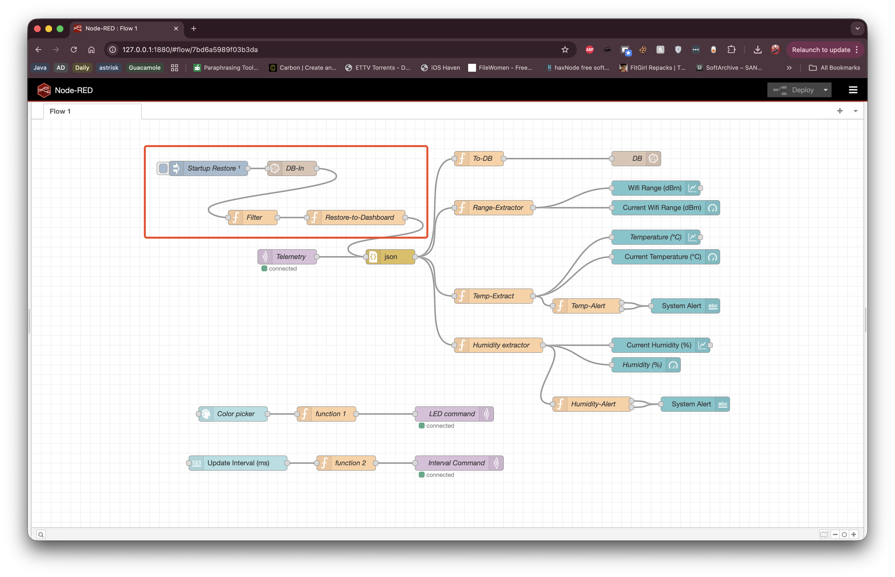
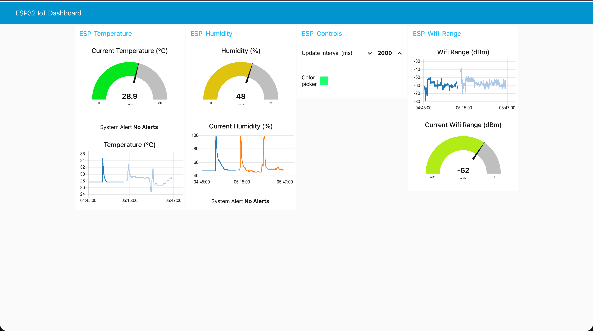
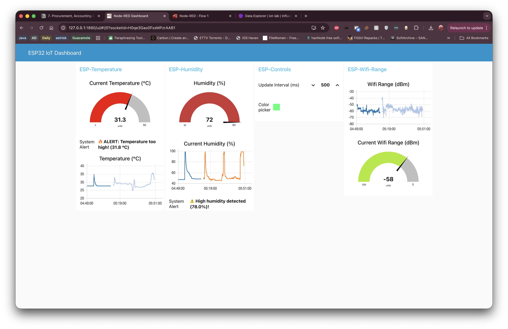
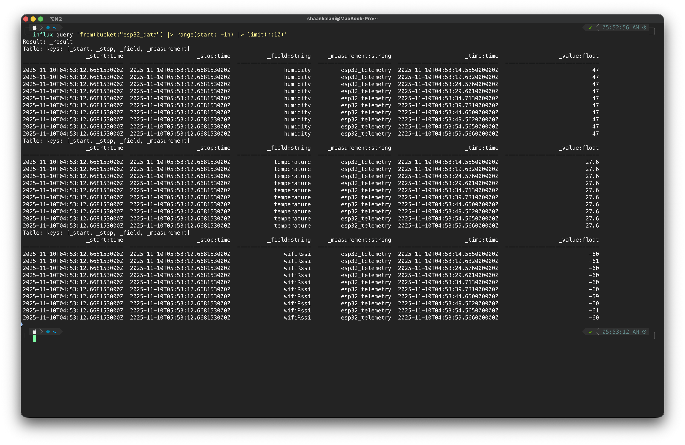

<h1 align="center">B31OT – IoT Environmental Monitoring System</h1>

<p align="center">
  
</p>

<p align="center">
  <b>ESP32 • MQTT • Node-RED • InfluxDB • Real-Time Environmental Monitoring</b>
</p>

---

# 📘 Overview

This project is a complete IoT environmental monitoring platform built using ESP32, MQTT, Node-RED and InfluxDB. It enables real-time monitoring of temperature, humidity and WiFi strength with alerts and dashboard recovery.

---

# 📂 Repository Structure

```
documentation/
    B31OT_Report.pdf
    images/
        dashboard_alerts.png
        dashboard_main.png
        esp32_hardware.png
        Flow_node-rade.png
        influx_query_results.png
        node_red_restore_flow.png
esp32/
    firmware.ino
influx/
    influx_query_results.txt
    mqtt_logs.txt
nodered/
    flow.json
README.md
```

---

# 📸 Proof of Concept - PoC
https://github.com/user-attachments/assets/24f35be6-9f88-4529-a10f-f0caf39de478

# 🧠 System Architecture

## 📡 Node-RED Main Flow


## 🔄 Dashboard Restore Flow


---

# 🖥 Dashboards

## 📊 Main Dashboard


## 🚨 Alerts Dashboard


---

# 📈 InfluxDB Query Results


Results stored in:
```
influx/influx_query_results.txt
```

---

# 🧰 ESP32 Firmware
Located in:
```
esp32/firmware.ino
```

---

# ✔ Author
Shaan Kalani (B31OT IoT Coursework)
